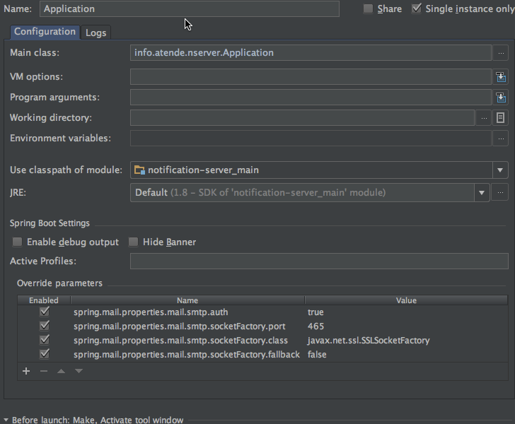

Notification Server Project
============================
[](https://app.shippable.com/projects/540e84d43479c5ea8f9f0513/builds/latest)

This project is part of a central architecture when several applications should send email, and use this as a service.

[Documentação](http://wiki.atende.info/display/wa)

## Technology

* Spring Boot
* PostgreSQL Database

This server creates a ThreadPool to send e-mails. The HTTP request is asyncronous.
By default it creates a Pool with the parameters:

    async.corePoolSize=50
    async.maxPoolSize=100
    async.queueCapacity=500

You can override that in the spring config properties

## Performance Test

You can use apache2-utils for performance test. There is a email-post.data file in the docs folder for convenience
The code to test the email sender service is:

    ab -n 1041 -c 30 -p docs/email-post.data -T application/x-www-form-urlencoded  http://localhost:8081/api/notification/email

## Configuration of email

You need to configure the email sender

    mail.from=no-reply@test.com

Use this configuration on file. In production this can be override by ENV variables or command line. See [Spring Boot Config]

    mail.from=no-reply@test.com
    spring.mail.host=localhost
    spring.mail.port=3025
    spring.mail.protocol=smtp

Gmail Example:

    mail.from=no-reply@test.com
    spring.mail.host=smtp.gmail.com
    spring.mail.username=*****@gmail.com
    spring.mail.password=****
    spring.mail.properties.mail.smtp.auth=true
    spring.mail.properties.mail.smtp.socketFactory.port=465
    spring.mail.properties.mail.smtp.socketFactory.class=javax.net.ssl.SSLSocketFactory
    spring.mail.properties.mail.smtp.socketFactory.fallback=false

Microsoft Office 365 Example:

    mail.from=no-reply@test.com
    spring.mail.host=smtp.office365.com
    spring.mail.username=****
    spring.mail.password=****
    spring.mail.port=587
    spring.mail.properties.mail.smtp.auth=true
    spring.mail.properties.mail.smtp.starttls.enable=true

Example using env variables

    export MAIL_FROM=****
    export SPRING_MAIL_HOST=smtp.office365.com
    export SPRING_MAIL_USERNAME=****
    export SPRING_MAIL_PASSWORD=****
    export SPRING_MAIL_PORT=587
    #export SPRING_MAIL_PROPERTIES_MAIL_SMTP_AUTH=true
    #export SPRING_MAIL_PROPERTIES_MAIL_SMTP_STARTTLS_ENABLE=true

PS.: Don't use **STARTTLS_ENABLE** and **SMTP_AUTH** with env variables, in my test it not work, and put that in
command line parameter

You can configure that on the IDE to override for dev. Don't edit **-dev.properties** because it is checked on version control



## Configuration of Database

You can configure Spring application in many different ways. In production the best way
is using environment configuration, or using command line. The spring config file use the follow
properties (extracted from _dev_ environment):

    params.datasource.jdbcUrl=jdbc:postgresql://docker.local/notification
    params.datasource.username=super
    params.datasource.password=1234

That configuration became env variables:

* PARAMS_DATASOURCE_JDBC_URL
* PARAMS_DATASOURCE_USERNAME
* PARAMS_DATASOURCE_PASSWORD

Or command line parameters:

* --params.datasource.jdbcUrl
* --params.datasource.username
* --params.datasource.password

For more information see [Spring Boot Config]

## Usage from a dev perspective

The application is preconfigured to use the credentials on *dev* and *test* spring profiles:

| User  | Password | Host         |
|-------|----------| ------------ |
| super | 1234     | docker.local |
|       |          |              |

The **dev** profile is the default when running the application, it changes to test when running on tests because
of `@SpringTestProfile` annotation

**dev** connects to a **notification** database and **test** connect to a **notification_test** database

Using docker and docker compose you can bring that to life:

    docker-compose up

Alter your **/etc/hosts** file pointing to the real docker ip. If you are on linux point to *127.0.0.1* if you
use **docker-machine** point to `docker-machine ip default` # default is the name of machine


    sudo echo "127.0.0.1 docker.local" >> /etc/hosts

## Keycloak Configuration

The project uses [Keycloak Server] to authentication

_Dev_ ENV use the file **src/main/resources/keycloak-dev.json**
The _default_ ENV use file **src/main/resources/keycloak-prod.json**

Both are not in git, and you need to create one for the application.

You can override the location with **--keycloak.configurationFile**. Example:

    --keycloak.configurationFile=file:///etc/keycloak.json

## Running Tests

```
./gradlew test
```

[Spring Boot Config]:https://docs.spring.io/spring-boot/docs/current/reference/html/boot-features-external-config.html
[Keycloak Server]:http://keycloak.jboss.org